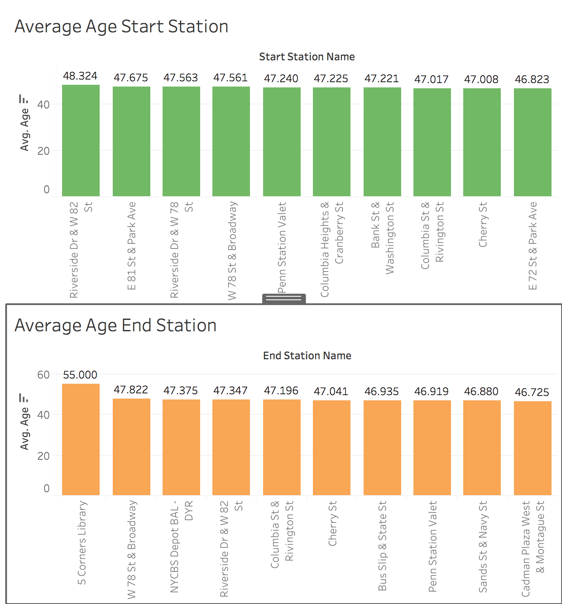
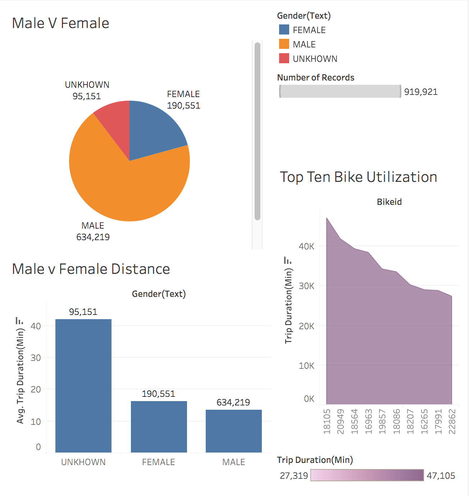
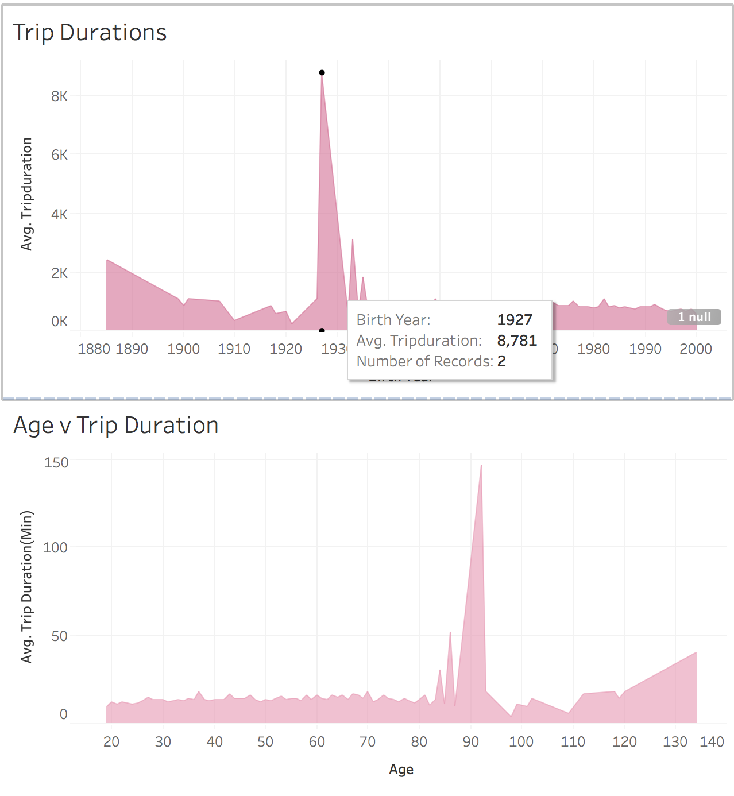
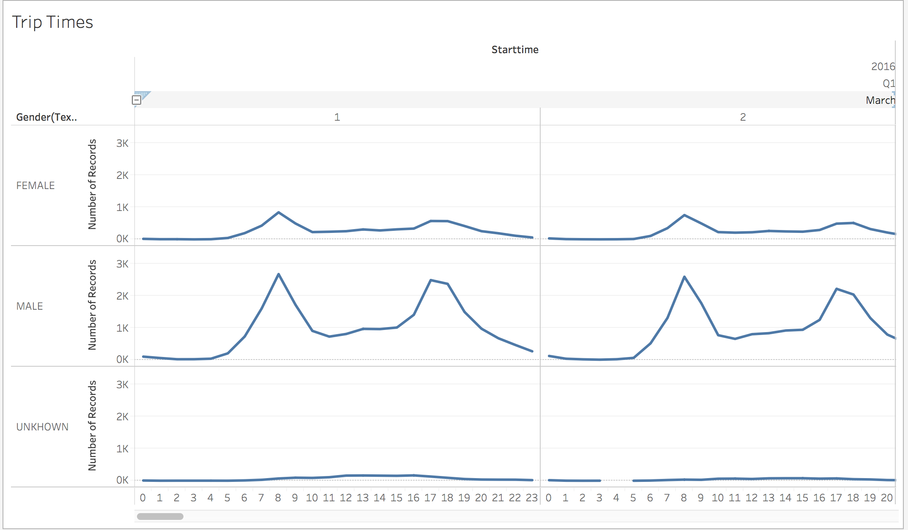
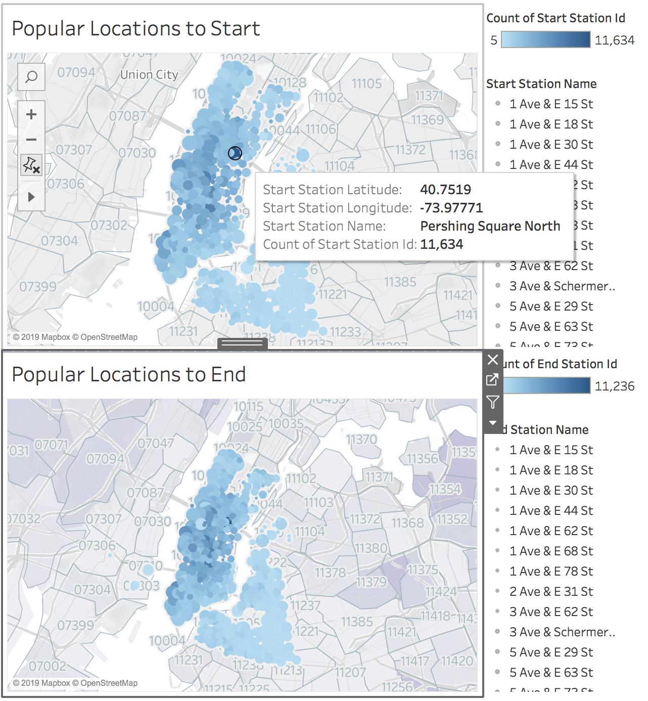

# Citi-Bike-Analysis

## Background

Since 2013, the Citi Bike Program has implemented a robust infrastructure for collecting data on the program's utilization. Each month bike data is collected, organized, and made public on the Citi Bike Data webpage(https://www.citibikenyc.com/system-data). My task on the job was to build a set of data reports to visulize bike utilization and popular stations. 

## Data Analysis

The citi bike data I used was from March 2016. I used Tableau to create ten different charts. According to the ten charts, I figured out the following questions. 

1. The top ten popular start and end stations are:

2.	The number of male participants used citi bike was three times than female participants, but female’s average trip duration was higher than males. Bike Id is 18105 had the highest number of trip duration.

3.	Average trip duration got dramatically increased around late age of 80 to early age of 90. After age of 92, the average trip duration dropped down. Bike birth year in 1927 had the highest number of average trip duration.

4.	The peak hours for usage of bikes were 8am and 6pm on March 2016.

## Map visualization for city officials

* According the popluartion location charts, a lot of people use citi bike, they live in Brooklyn area. People also ride citi bike to New Jersey from Manhattan. 

